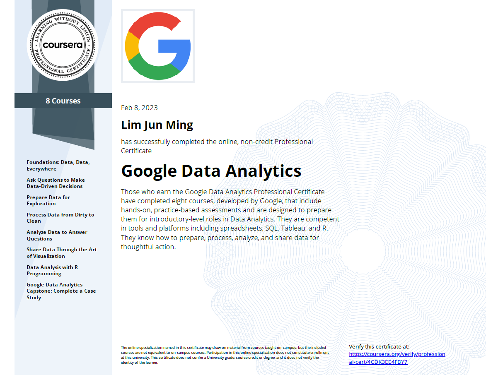

# Google Data Analytics Professional Certificate  
  
This my capstone for the [Google Data Analytics Professional Certificate](https://grow.google/certificates/data-analytics/)  
I wrote [a report](Bellabeat.pdf) for Case Study 2, to analyse fitness tracker data to inform marketing strategies.  
  
## Certificate  
Here's a screenshot of my certificate.  
  
  
And the accompanying badge,  
  
  
## Description  
The problem statement is in `CaseStudy2_Bellabeat.pdf`.  
The main report I created in response is `Bellabeat.rmd`, `Bellabeat.html`, or `Bellabeat.pdf`.  
The accompanying datasets are in `data/`, or they could be directly downloaded as specified in the report.  